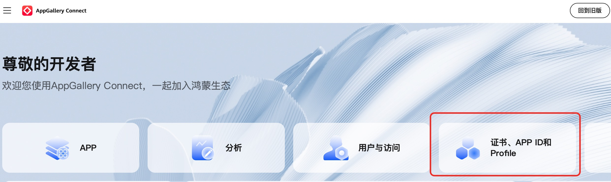
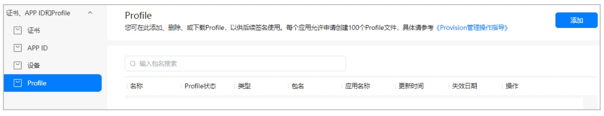
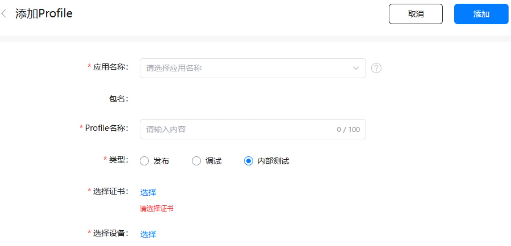

# HarmonyOSQuickPack

<p align=center>
      
<br/>
【有任何使用上的问题或者想查看鸿蒙相关的技术文章，都可以微信扫描以上二维码，进行关注！】
</p>

鸿蒙系统，内部应用打包工具，一键打包，彻底解放您的双手！告别提交应用商店审核限制！

使用内部测试，您可以将应用发布上传至您的服务器或者第三方云上，团队参与测试的人员可以将应用下载到授权的设备上测试。您可以更灵活发布版本和限定测试范围，助您提前发现问题，及时修复问题和优化版本体验。

插件最新版本：1.1

插件下载地址：[点击下载](https://abnerming888.github.io/vip/load/HarmonyOSAppPackSign-1.1.jar)

插件使用说明文档：[点击查看](https://juejin.cn/post/7526541171012255778)

使用插件之前，您首先要有内部测试Profile文件和配置内部测试应用签名。


## 内部测试Profile申请及应用签名配置流程

内部测试包，必须使用内部测试Profile文件进行签名，方可进行安装下载。

### 内部测试Profile申请

申请内部测试Profile步骤和申请正式的Profile步骤是一样的。

1、登录[AppGallery Connect](https://developer.huawei.com/consumer/cn/service/josp/agc/index.html#/)，选择“证书、APP ID和Profile”。



2、在左侧导航栏选择“证书、APP ID和Profile > Profile”，进入“Profile”页面，点击右上角“添加”。



3、这里选择内部测试，其他的信息和你之前申请发布类型一样。




| 参数       | 说明 |
|----------| ------------------------------------------------------------------------------------------------------------------------------------------ |
| 应用名称     | 选择需要申请内部测试Profile的应用名称。如尚未新建应用，请先[前往“APP ID”菜单创建应用](https://developer.huawei.com/consumer/cn/doc/app/agc-help-create-app-0000002247955506)。 |
| 包名       | 选择应用名称后自动填充。                                                                                                                               |
| Profile名称 | 不超过100个字符。                                                                                                                                 |
| 类型       | 选择“内部测试”。                                                                                                                                  |
| 选择证书     | 点击“选择”，选择一个[发布证书](https://developer.huawei.com/consumer/cn/doc/app/agc-help-release-cert-0000002283336729)。                                |
| 选择设备     | 点击“选择”，选择一个或多个[测试设备](https://developer.huawei.com/consumer/cn/doc/app/agc-help-add-device-0000002283189937)。最多可选择100个设备，已删除的设备无法选择。


#### 注意事项

选择证书时，请选择发布证书，测试设备一定要选择，否则未添加至设备的手机是无法进行安装应用的。

内部测试Profile生成之后，下载保存！

### 应用签名配置流程

正式签名是如何配置的，那么内部测试仿照即可。

首先配置内部测试签名信息，仿照正式签名信息复制一份即可，名字自定义，需要注意，profile字段，设置成你创建的内部测试Profile，其他信息和正式签名保持一致。

```json
"signingConfigs": [
      //……其他签名信息
      {
        "name": "internalTesting",
        "type": "HarmonyOS",
        "material": {
          "storeFile": "你的秘钥.p12文件",
          "storePassword": "你的秘钥密码",
          "keyAlias": "你的别名",
          "keyPassword": "你的别名密码",
          "signAlg": "SHA256withECDSA",
          "profile": "你的内部测试Profile文件也就是.p7b文件",
          "certpath": "你的发布证书.cer文件"
        }
      }
    ]
```

配置品类信息，复制其他品类信息，增加内部测试品类信息，名字自定义，signingConfig选择内部测试签名信息。

```json
"products": [
     //……其他品类
      {
        "name": "internalTesting",
        "signingConfig": "internalTesting",
        "compatibleSdkVersion": "5.0.0(12)",
        "targetSdkVersion": "5.0.0(12)",
        "runtimeOS": "HarmonyOS",
        "buildOption": {
          "strictMode": {
            "useNormalizedOHMUrl": true
          }
        }
      }
    ]
```

配置modules信息，记住，modules下，你有几个模块，就要配置几个模块，并且每个模块下的applyToProducts配置要保持一致，
并把内部测试品类信息配置上。

```json
"modules": [
    {
      "name": "entry",
      "srcPath": "./entry",
      "targets": [
        {
          "name": "default",
          "applyToProducts": [
            "default",
            "internalTesting"
          ]
        }
      ]
    }
  ]
```

### 相关总结

以上信息配置完成之后，就可以在插件中，选择你的内部测试品类进行打包了。


## 插件配置说明

鸿蒙内测打包工具主要辅助应用打包，应用内部测试工作，使用此工具，测试包无须再提交至AppGallery，便可实现极速打包，极速测试验证工作， 方便研发团队及时迅速的把测试包提交至测试团队验证，达到和Android端Apk的形式效果。
鸿蒙内测打包工具，所有的配置数据均存在您的本地，无上传远程操作，请放心使用，上传应用包时，请您遵守鸿蒙官方规则， 并遵守法律法规，打出的包仅可以用于团队内部，进行测试验证工作，感谢您的支持与理解！

注意：安装好插件之后，请第一时间完成基础配置工作，如无基础配置，仅支持部分功能使用。

正常情况下，大家只需要关注一键更新和查看更新包两个功能即可，当然你也可以分步骤来执行！

### 基础配置

基础配置主要配置密钥文件以及云资源上传信息，密钥文件主要用于描述文件的签名，这是内部测试包的必须选项，所以请大家务必正确配置，在配置时，请配置原始的密码和别名密码，请不要使用加密的密码，如下配置：

<p align=center>
      
</p>
 
设置上传方式的目的，是需要将打出的应用包存储到哪里，以便于进行下载使用，目前提供了有腾讯云和阿里云两种方式，后续看大家需求，再拓展其它的服务器或者本地服务器。
腾讯云和阿里云，没什么好说的，大家按照信息配置即可，这些可以在官方后台就能查看，需要确定的是，请把Bucket设置为可读可写，当然了，如果您感觉有风险，可以上传完毕后再修改为可读即可。

#### 腾讯云
<p align=center>
      
</p>
 
#### 阿里云
<p align=center>
      
</p>
 
### 功能介绍

#### 0、选择内部测试品类

内部测试品类指的是，使用AppGallery Connect申请的内部测试Profile文件，这个是必须的，如果您还未申请，请按照官方提示进行申请，或直接看上面的申请步骤即可。

####  1、一键更新

一键更新，从构建打包，到上传资源包，一气呵成，无须再分步骤实现，极大提高出包效率！后续，只关注这个功能即可！

#### 2、查看更新包

在这里，可以查看历史更新的包，可以对其复制链接，或者查看二维码，可以直接把链接或二维码发送给测试人员，供其下载使用。

<p align=center>
      
</p>
 
#### 3、全部功能

全部功能是一键更新功能的分步骤实现，大家可以进行逐步实现

